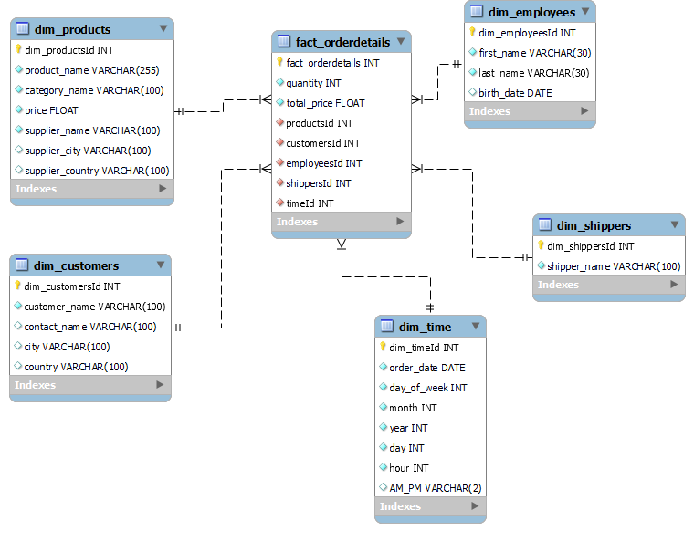

# ETL proces datasetu Northwind
Tento repozitár obsahuje implementáciu ETL procesu v Snowflake pre analýzu dát z Northwind datasetu. Projekt sa zameriava na analýzu správania zákazníkov a ich nákupných preferencií na základe informácií o objednávkach, produktoch a zákazníkoch. Výsledný dátový model umožňuje multidimenzionálnu analýzu a vizualizáciu kľúčových metrik, ako sú tržby, obľúbenosť produktov, a sezónne trendy.
# 1. Úvod a popis zdrojových dát
Cieľom tohto semestrálneho projektu je analyzovať dáta o zákazníkoch, objednávkach, produktoch a zamestnancoch v Northwind databáze. Projekt sa zameriava na identifikáciu obchodných trendov, preferencií zákazníkov a správanie zamestnancov, ktoré môžu pomôcť pri optimalizácii predajov a poskytovaní lepších služieb zákazníkom.

Zdrojové dáta pochádzajú z datasetu na githube [tu](https://github.com/microsoft/sql-server-samples/tree/master/samples/databases/northwind-pubs). Dataset obsahuje 8 hlavných tabuliek:

- `orderdetails`
- `products`
- `categories`
- `suppliers`
- `shippers`
- `orders`
- `customers`
- `employees`

Účelom ETL procesu bolo tieto dáta pripraviť, transformovať a sprístupniť pre viacdimenzionálnu analýzu.
# 1.1 Dátová architektúra
Surové dáta sú usporiadané v relačnom modeli, ktorý je znázornený na entitno-relačnom diagrame (ERD):
<p align="center">
  
  <br>
  <i>Obrázok 1: Entitno-relačná schéma databázy Northwind.</i>
</p>

# 2 Dimenzionálny model
Navrhnutý bol hviezdicový model (star schema), pre efektívnu analýzu, kde centrálny bod predstavuje faktová tabuľka `fact_orderdetails`, ktorá je prepojená s dimenzionálnmi tabuľkami:
- `dim_products`: Obsahuje informácie o produktoch vrátane ich názvu, ceny, kategórie a údajov o dodávateľoch.
- `dim_customers`: Uchováva demografické údaje zákazníkov, ako meno, kontaktné údaje, mesto a krajinu.
- `dim_employees`:  Zaznamenáva informácie o zamestnancoch, ako sú mená a dátumy narodenia.
- `dim_shippers`: Obsahuje detaily o prepravcoch vrátane ich názvu.
- `dim_time`: Poskytuje časové údaje o objednávkach vrátane dátumu, času a ďalších časových dimenzií (rok, mesiac, deň, AM/PM).

Štruktúra hviezdicového modelu je znázornená na diagrame nižšie. Diagram ukazuje prepojenia medzi faktovou tabuľkou a dimenziami, čo zjednodušuje pochopenie a implementáciu modelu.
<p align="center">
  
  <br>
  <i>Obrázok 2 Schéma hviezdy pre Northwind.</i>
</p>

# 3 ETL proces v Snowflake

ETL proces pozostával z troch hlavných fáz: extrahovanie (Extract), transformácia (Transform) a načítanie (Load). Tento proces bol implementovaný v Snowflake s cieľom pripraviť zdrojové dáta zo staging vrstvy do viacdimenzionálneho modelu vhodného na analýzu a vizualizáciu.

## 3.1 Extract (Extrahovanie dát)

Dáta zo zdrojového datasetu (formát .csv) boli najprv nahraté do Snowflake prostredníctvom interného stage úložiska s názvom my_stage. Stage v Snowflake slúži ako dočasné úložisko na import alebo export dát. Vytvorenie stage bolo zabezpečené príkazom:

#### Príklad kódu:

```sql
CREATE OR REPLACE STAGE my_stage;
```
Do stage boli následne nahrané súbory obsahujúce údaje o rôznych entitách, ako sú kategórie, zákazníci, zamestnanci, objednávky, detaily objednávok, produkty, dodávatelia a prepravcovia. Tieto dáta boli následne spracované a importované do staging tabuliek pomocou príkazu COPY INTO. Pre každú tabuľku sa použil obdobný príkaz, upravený podľa konkrétnych dát a požiadaviek.

```sql
COPY INTO products_staging
FROM @my_stage/products.csv
FILE_FORMAT = (TYPE = 'CSV' SKIP_HEADER = 1);
```

V prípade nekonzistentných záznamov bol použitý parameter ON_ERROR = 'CONTINUE', ktorý zabezpečil pokračovanie procesu bez prerušenia pri chybách.

## 3.2 Transfor (Transformácia dát)

